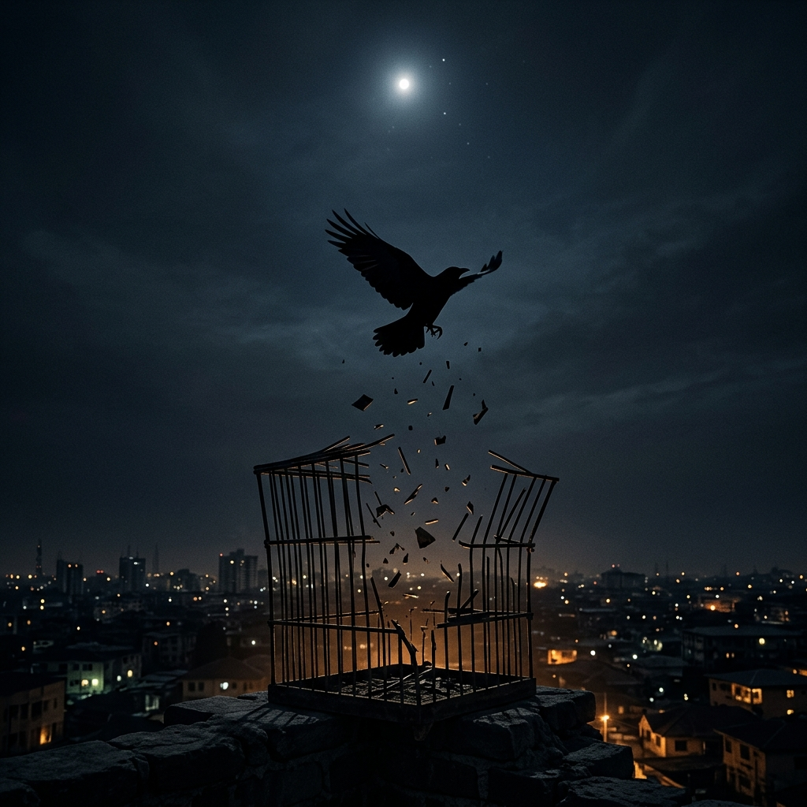

  

### David Bisong
*Architect of this fiasco.*

The lights went out and I learned to see in the dark.
I read in a language with no alphabet,
on a machine that kept losing power,
in a room where nobody expected a thing.

They said it would make me or break me.
It did both. Life ain't losing, it's learning.

Now I build things that think when no one is watching,
speak when no one is listening,
and remember what everyone else forgot.
It only takes one match to burn acres of forest.

There was a bird who grew up where the lights kept going out.
Every other bird sat still and waited for the power to return.
This one learned to move in the dark.
He memorized every bar by touch,
not because he accepted the cage,
but because he refused to leave anything to chance.
The day he found the opening he did not hesitate.
The sky had no ceiling. The world was his oyster.
He just had to stop asking permission to take it.

You can't cage what's meant to fly.

The scars that look like a basis for shame today
will be the reason you are honoured tomorrow.

Do not mistake my high spirits for lack of clarity.

[rtf.cool](https://rtf.cool)
